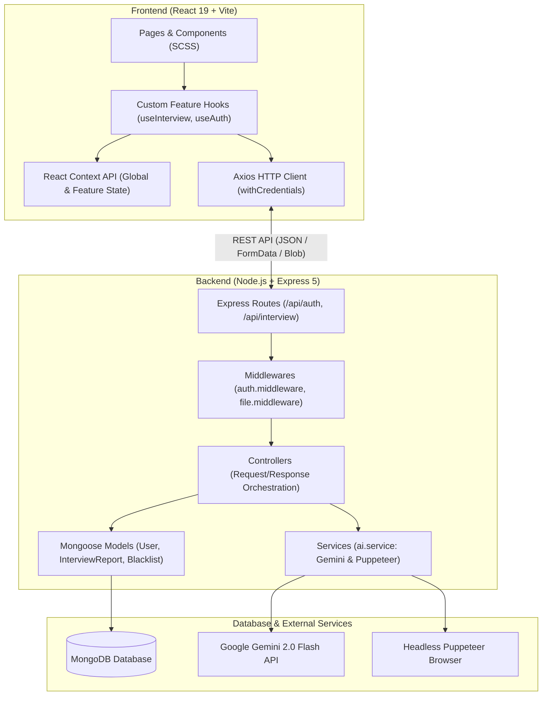
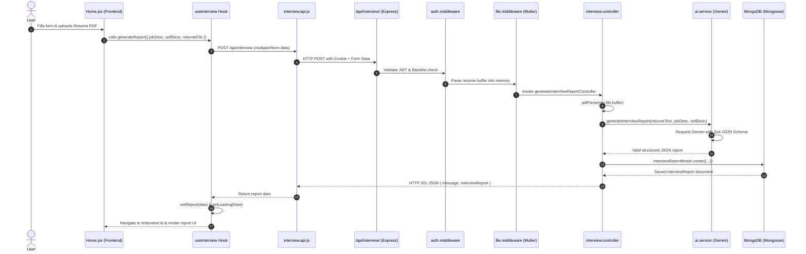

# Full-Stack AI Application Architecture Guide

A comprehensive architectural reference guide based on the **Interview AI** codebase. Use this document as a blueprint and design standard for building scalable full-stack GenAI web applications.

---

## Table of Contents
1. [High-Level System Architecture](#high-level-system-architecture)
2. [Project Directory Structure](#project-directory-structure)
3. [Backend Architecture & Design Patterns](#backend-architecture--design-patterns)
   - [Layered MVC Pattern](#layered-mvc-pattern)
   - [Structured AI Generation Pipeline](#structured-ai-generation-pipeline)
   - [Server-Side PDF Generation Pipeline](#server-side-pdf-generation-pipeline)
   - [Authentication & Token Lifecycle](#authentication--token-lifecycle)
4. [Frontend Architecture & Design Patterns](#frontend-architecture--design-patterns)
   - [Feature-Sliced Modular Structure](#feature-sliced-modular-structure)
   - [Context + Custom Hook State Management](#context--custom-hook-state-management)
   - [Route Protection & Auth Guard](#route-protection--auth-guard)
5. [End-to-End Request/Response Flow](#end-to-end-requestresponse-flow)
6. [Reusable Starter Blueprint for Future Projects](#reusable-starter-blueprint-for-future-projects)
7. [Recommended Production Enhancements](#recommended-production-enhancements)

---

## High-Level System Architecture

This system implements a **Decoupled Client-Server Monorepo Architecture** separating the **Frontend (Feature-Sliced React SPA with Vite)** and **Backend (Layered Express REST API with MongoDB & Google Gemini AI)**.



---

## Project Directory Structure

```
interview-ai/
├── Backend/                       # Express REST API Server
│   ├── .env                       # Environment secrets (PORT, MONGO_URI, JWT_SECRET, GOOGLE_GENAI_API_KEY)
│   ├── .gitignore
│   ├── package.json
│   ├── server.js                  # Application entry point & DB connection initialization
│   └── src/
│       ├── app.js                 # Express app config, CORS, cookie parser, route mounting
│       ├── config/
│       │   └── database.js        # MongoDB connection setup via Mongoose
│       ├── controllers/           # HTTP Request Handlers (coordinate Services & Models)
│       │   ├── auth.controller.js
│       │   └── interview.controller.js
│       ├── middlewares/           # Intercepting Middleware
│       │   ├── auth.middleware.js # JWT verification & blacklist token validation
│       │   └── file.middleware.js # Multer memory storage for file uploads
│       ├── models/                # Database Schemas (Data Layer)
│       │   ├── blacklist.model.js # Blacklisted JWT tokens for logout invalidation
│       │   ├── interviewReport.model.js # Nested schemas for structured reports
│       │   └── user.model.js      # User credentials & profile data
│       ├── routes/                # Endpoint Declarations & Middleware Chaining
│       │   ├── auth.routes.js     # /api/auth/*
│       │   └── interview.routes.js# /api/interview/*
│       └── services/              # Pure Business Logic & External Integrations
│           └── ai.service.js      # Gemini GenAI + Zod schema enforcement & Puppeteer PDF engine
│
└── Frontend/                      # Vite + React Single-Page Application
    ├── .env                       # Client environment variables (VITE_API_BASE_URL)
    ├── index.html                 # Single page root HTML
    ├── package.json
    ├── vite.config.js             # Vite bundler configuration
    └── src/
        ├── App.jsx                # Application shell with Context Providers & RouterProvider
        ├── app.routes.jsx         # Centralized React Router v7 configuration
        ├── main.jsx               # React DOM root render
        ├── style/
        │   └── style.scss         # Global styles, CSS variables, typography & resets
        └── features/              # Feature-Sliced Modular Architecture
            ├── auth/              # Authentication Feature Slice
            │   ├── auth.context.jsx # Auth user state provider
            │   ├── auth.form.scss   # Auth form styling
            │   ├── components/    # Feature-specific components
            │   │   └── Protected.jsx# Route guard redirecting unauthenticated users
            │   ├── hooks/         # Custom hooks for auth actions
            │   │   └── useAuth.js
            │   ├── pages/         # Login & Register views
            │   │   ├── Login.jsx
            │   │   └── Register.jsx
            │   └── services/      # Axios calls for authentication
            │       └── auth.api.js
            └── interview/         # Interview Feature Slice (Core Business Domain)
                ├── interview.context.jsx # Interview state (reports, current report, loading)
                ├── hooks/         # Custom hooks (useInterview.js)
                ├── pages/         # Domain pages (Home.jsx, Interview.jsx)
                ├── services/      # Axios calls (interview.api.js)
                └── style/         # Feature-specific styling
```

---

## Backend Architecture & Design Patterns

### Layered MVC Pattern

```
[HTTP Request]
      │
      ▼
┌───────────────┐
│ Router        │  Routes define the URI pattern and bind Middlewares + Controller
└───────┬───────┘
        ▼
┌───────────────┐
│ Middlewares   │  Validates authentication, parses multipart form data, sanitizes inputs
└───────┬───────┘
        ▼
┌───────────────┐
│ Controllers   │  Orchestrates request payload, invokes Services, queries Models, formats JSON response
└───────┬───────┘
        ├───────────────────────────────┐
        ▼                               ▼
┌───────────────┐               ┌───────────────┐
│ Services      │               │ Models        │
│ (AI, PDF)     │               │ (Mongoose)    │
└───────────────┘               └───────────────┘
```

1. **`server.js`**: Dedicated server bootstrap. Keeps DB connection and port listening isolated from testable Express configuration.
2. **`src/app.js`**: Express instance configurator. Sets up CORS with credentials, cookie parsing, JSON body parsing, and route namespaces.
3. **`routes/`**: Clean endpoint mapping. Does not contain business logic.
4. **`controllers/`**: Extracts data from `req.body`, `req.file`, `req.params`, passes data to services/models, and returns standard JSON responses with proper HTTP status codes (`200`, `201`, `400`, `401`, `404`, `500`).
5. **`services/`**: Independent, testable functions handling external API calls (Google Gemini AI) or file system processes (Puppeteer).
6. **`models/`**: MongoDB schemas with type validations, required constraints, and subdocument schemas.

---

### Structured AI Generation Pipeline

Instead of receiving unstructured text/markdown and using fragile regular expressions, the backend uses **Strict Schema-Enforced JSON Output** via `@google/genai` and `zod`:

```javascript
// 1. Define schema using Zod
const interviewReportSchema = z.object({
  matchScore: z.number().min(0).max(100),
  technicalQuestions: z.array(
    z.object({
      question: z.string(),
      intention: z.string(),
      answer: z.string()
    })
  ),
  behavioralQuestions: z.array(
    z.object({
      question: z.string(),
      intention: z.string(),
      answer: z.string()
    })
  ),
  skillGaps: z.array(
    z.object({
      skill: z.string(),
      severity: z.enum(["low", "medium", "high"])
    })
  ),
  preparationPlan: z.array(
    z.object({
      day: z.number(),
      focus: z.string(),
      tasks: z.array(z.string())
    })
  ),
  title: z.string()
});

// 2. Supply schema to Gemini
const response = await ai.models.generateContent({
  model: "gemini-2.0-flash",
  contents: prompt,
  config: {
    responseMimeType: "application/json",
    responseSchema: zodToJsonSchema(interviewReportSchema)
  }
});

// 3. Guaranteed valid JSON matching schema
const parsedResult = JSON.parse(response.text);
```

---

### Server-Side PDF Generation Pipeline

To generate professional ATS-friendly PDFs:
1. Gemini generates customized semantic HTML according to a strict prompt and JSON schema (`{ html: string }`).
2. Headless Chromium (`puppeteer`) launches in a sandbox-safe environment.
3. HTML is rendered on a virtual page and exported directly into an A4 PDF buffer.
4. The Express controller sends the binary buffer with `Content-Type: application/pdf` and `Content-Disposition: attachment`.

---

### Authentication & Token Lifecycle

* **Tokens**: Stateless JWTs signed with `JWT_SECRET` and expiration (`1d`).
* **Transport**: Passed in `HttpOnly` / secure cookies to prevent XSS credential theft.
* **Logout Invalidation (Blacklist Pattern)**:
  * When logging out, the token is stored in MongoDB (`tokenBlacklistModel`) with a TTL index.
  * `auth.middleware.js` checks every incoming request against the blacklist to ensure revoked tokens cannot be reused.

---

## Frontend Architecture & Design Patterns

### Feature-Sliced Modular Structure

Code is organized **by business domain** (`features/auth`, `features/interview`) rather than purely technical roles (`components/`, `pages/`, `hooks/`).

```
features/
└── [feature_name]/
    ├── components/       # UI elements specific only to this feature
    ├── hooks/            # Custom hooks encapsulating state & API logic
    ├── pages/            # Page-level route views
    ├── services/         # Axios API service functions
    ├── [feature].context.jsx # React Context for feature-level state
    └── style/            # Feature SCSS styles
```

**Benefits**:
* High cohesion: Modifying a feature touches only files within that feature's directory.
* Scalability: Adding a new feature (e.g. `features/payment` or `features/analytics`) requires no restructuring of existing code.

---

### Context + Custom Hook State Management

The frontend combines React Context for state storage with **Custom Hooks** as the controller layer:

1. **Context Provider**: Exposes state variables (`report`, `reports`, `loading`) and setters.
2. **Custom Hook (`useInterview`)**:
   - Handles async API calls (`generateReport`, `getReportById`, `getReports`, `getResumePdf`).
   - Automatically manages `loading` spinners and error logging.
   - Synchronizes URL parameters (e.g. `interviewId`) via `useEffect` to fetch data automatically on page navigation.
3. **Components & Pages**: Clean UI components that simply consume `const { report, loading, generateReport } = useInterview()`.

---

### Route Protection & Auth Guard

Protected routes are wrapped with a dedicated guard component in `app.routes.jsx`:

```jsx
// src/app.routes.jsx
export const router = createBrowserRouter([
  { path: "/login", element: <Login /> },
  { path: "/register", element: <Register /> },
  { path: "/", element: <Protected><Home /></Protected> },
  { path: "/interview/:interviewId", element: <Protected><Interview /></Protected> }
]);
```

The `<Protected>` component inspects the `AuthContext` user status and redirects unauthenticated users to `/login`.

---

## End-to-End Request/Response Flow

### Example: Generating an Interview Report



---

## Reusable Starter Blueprint for Future Projects

Copy this directory structure as a clean boilerplate for future projects:

```text
my-new-project/
├── Backend/
│   ├── .env.example
│   ├── package.json
│   ├── server.js
│   └── src/
│       ├── app.js
│       ├── config/
│       │   └── db.config.js
│       ├── controllers/
│       │   └── [feature].controller.js
│       ├── middlewares/
│       │   ├── auth.middleware.js
│       │   ├── validate.middleware.js
│       │   └── error.middleware.js
│       ├── models/
│       │   └── [feature].model.js
│       ├── routes/
│       │   └── [feature].routes.js
│       ├── services/
│       │   └── [feature].service.js
│       └── utils/
│           └── apiResponse.js
│
└── Frontend/
    ├── .env.example
    ├── package.json
    ├── vite.config.js
    ├── index.html
    └── src/
        ├── main.jsx
        ├── App.jsx
        ├── app.routes.jsx
        ├── components/          # Global shared UI components (Navbar, Button, Modal)
        ├── hooks/               # Global shared hooks (useDebounce, useMediaQuery)
        ├── style/               # Global CSS/SCSS design tokens
        └── features/            # Business domain modules
            └── [feature-name]/
                ├── components/
                ├── hooks/
                ├── pages/
                ├── services/
                └── [feature].context.jsx
```

---

## Recommended Production Enhancements

When scaling this architecture to large production applications:

1. **Centralized Error Handling Middleware**:
   Add a global Express error handler (`err, req, res, next`) and custom `ApiError` classes to eliminate boilerplate `try/catch` in controllers.
2. **Request Validation Layer**:
   Use `zod` not only for LLM structured outputs, but also to validate incoming `req.body`, `req.query`, and `req.params` via middleware before reaching controllers.
3. **Async Job Queues (BullMQ / Redis)**:
   For heavy AI generation tasks or Puppeteer PDF conversions, offload processing to background workers with WebSockets/SSE for real-time progress updates.
4. **Environment Configuration Validation**:
   Validate `.env` variables at server startup using `zod` so the app fails fast if an API key or DB URI is missing.
5. **TypeScript Migration**:
   Introduce TypeScript to both Frontend and Backend to share DTOs (Data Transfer Objects) and Zod-inferred types across the client and server.
